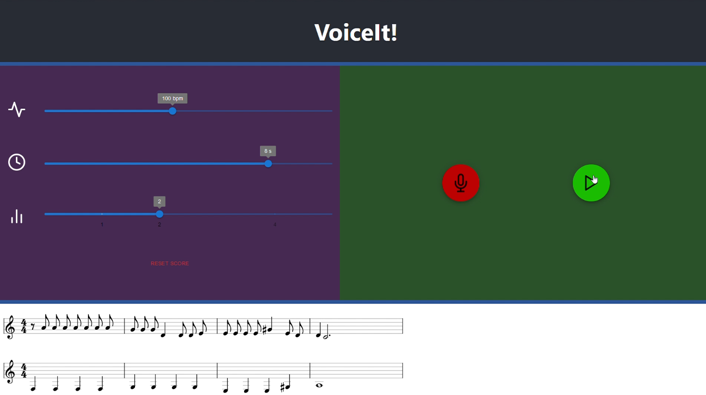

# VoiceIt



## Inspiration
🎵 We loooove music. However, one thing that bugged us was having a melody in our heads but not being able to write it easily down. We've tried many music composition softwares, but they all have their inconveniences. We are fortunate to have learned piano since a very young age, so music theory has helped us to an extent. So if even with our background we find it hard to write down music, then it must be much harder for those who don't know the theory.

So we thought: Why should one be limited to create great music just because one does not know the theory? What if we can build something that breaks down this barrier and unleash one's creativity? Introducing VoiceIt!...

**VoiceIt! generates music scores by listening to the user's voice**. In addition, VoiceIt! supports multiple tracks and playback capabilities. After deployment, it could be accessed anywhere with internet connection, allowing you to "voice it" wherever and whenever you need.

Demo and more details can be found at https://devpost.com/software/voiceit-f0eu4q.

## How it's built
### Frontend

- Built using ReactJS and Typescript
- Gets recording properties from users (e.g. beats per minute, length of recording, etc.)
- Displays the user's current music in a music staff for visualization

When the record button is pressed, a GET command is sent to the backend.

### Backend
- Built using Python and Flask
- Analyzes the audio track and obtain the correct notes. We relied heavily on librosa.

More about librosa:
- Through its pYIN function, we determine the fundamental frequency (ie. Pitch) of audio.
- The pYIN function also provided how likely each section was voiced, which was used to determine spacing and duration of the notes.
- Finally, all this information was converted to a format suitable to be displayed. For example, frequencies were converted to their notes; durations were rounded to the nearest beat allowed by the music granularity, and split up to be representable with normal note durations.


## Setup Instructions
### Setup backend
1. (Optional) Setup a venv and activate it \[[0](#sources)\]
1. ```pip install -r requirements.txt```

### Setup frontend
1. Navigate into frontend folder
1. ```npm install```

## Running Instructions
### Option 1: Seperate servers 
1. Run the backend: ```flask run``` in one terminal at root directory.
1. Run the webpage: ```npm run start``` in another terminal at the frontend folder.
1. Navigate to the webpage indicated in the second terminal.

### Option 2: Same server
1. (Optional if build folder already exists)```npm run build``` in the frontend folder.
1. ```flask run``` at root directory.
1. Navigate to the webpage indicated in the terminal.

### Option 3: Deployed
Because of how we set it up, we can also deploy it onto Google Cloud (and any other cloud service provider), where the backend could be set up as an API endpoint that the frontend (which would be deployed as well as a website) can hit. This hasn't been done yet, but it is a topic of future work!


## <a name="sources"></a>Sources
\[0\] https://realpython.com/python-virtual-environments-a-primer/